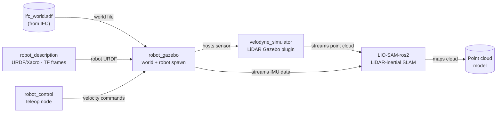

# ifc2pointcloud

Integrated ROS 2 workspace for generating point clouds from IFC-based building environments in Gazebo, with robot simulation, Velodyne LiDAR, and LIO-SAM.

## Project Scope

This repository combines:

- Mobile robot simulation in architectural scenes
- Velodyne LiDAR simulation and point cloud streaming
- LIO-SAM-based lidar-inertial odometry and mapping

## Reference Project

This project references and builds on ideas/workflow from Robot Mania's lio_sam_gazebo_ros2 project.

## System Architecture

## Workspace Packages

### 1) robot_gazebo

Role:
- Gazebo simulation package that contains worlds, models, and launch files.

Key contents:
- World files in src/robot_gazebo/worlds
- Robot and sensor models in src/robot_gazebo/models
- Launch entry point: src/robot_gazebo/launch/robot_sim.launch.py

Highlights:
- Loads IFC-derived SDF world (for example ifc_world.sdf)
- Starts Gazebo server/client with robot state publisher

### 2) robot_description

Role:
- Robot description package (URDF/Xacro and related assets) used by simulation and state publishing.

Highlights:
- Provides kinematic and frame definitions consumed by Gazebo/ROS 2

### 3) robot_control

Role:
- Basic robot control nodes/scripts.

Key contents:
- Control script: src/robot_control/scripts/robot_control.py

Highlights:
- Publishes /cmd_vel
- Consumes joystick and IMU topics for control behavior

### 4) lio_sam (from LIO-SAM-ros2)

Role:
- Lidar-inertial odometry and mapping backend.

Highlights:
- Real-time odometry and mapping from point cloud + IMU
- Includes ROS 2 launch/config structure for LIO-SAM workflows

### 5) velodyne_simulator stack

Role:
- Velodyne sensor simulation components.

Subpackages:
- velodyne_description: URDF descriptions for sensors
- velodyne_gazebo_plugins: Gazebo plugins to publish simulated lidar data
- velodyne_simulator: top-level simulator package

Highlights:
- PointCloud2 publishing with Velodyne-like fields
- Configurable scan parameters and noise

